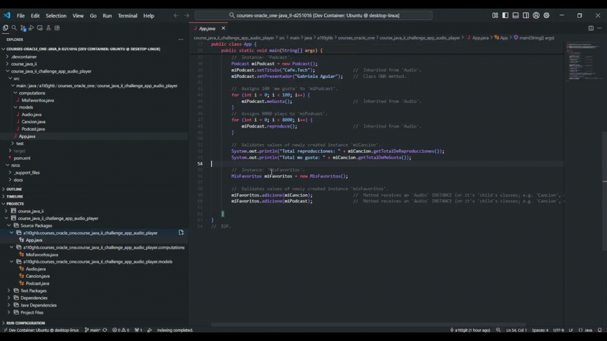
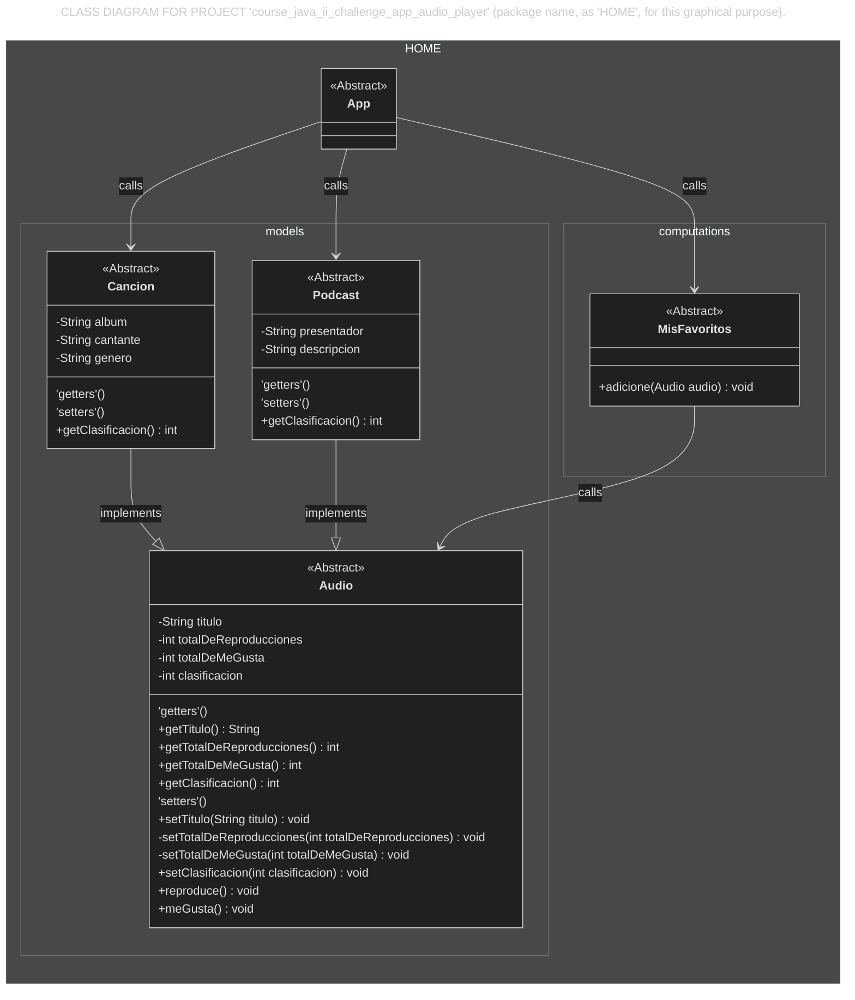
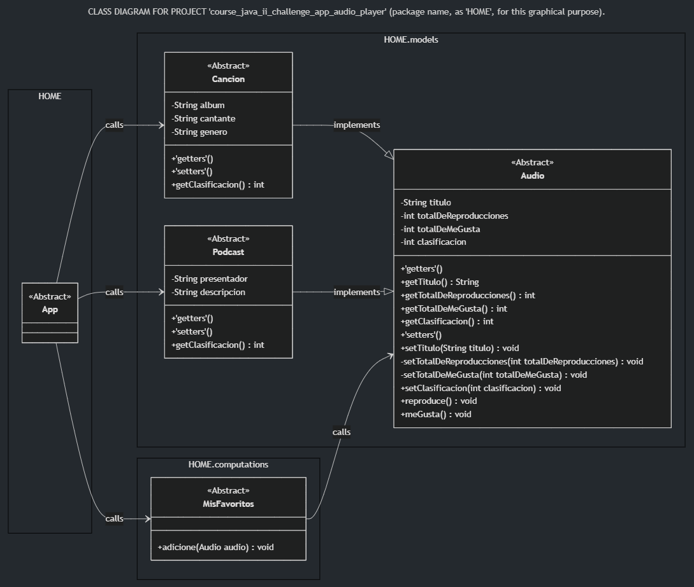
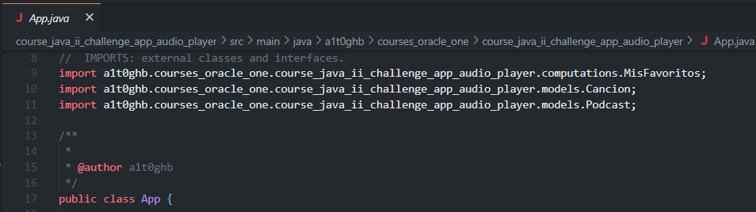

<!-- Badges:
- Source: 'https://shields.io/docs/static-badges', 'https://shields.io/badges/static-badge'.
- HTML structure followed: 'https://github.com/facebook/docusaurus/blob/main/README.md?plain=1'.
- Badges with logos: 'https://shields.io/docs/logos', 'https://simpleicons.org/', 'https://github.com/simple-icons/simple-icons/blob/master/slugs.md'.
- HTML <a> tag not redirecting: 'https://stackoverflow.com/questions/8260546/make-a-html-link-that-does-nothing-literally-nothing/8260561#8260561', 'https://www.geeksforgeeks.org/html/how-to-create-html-link-that-does-not-follow-the-link/'.
-->

<!-- Badge: WIP

  

 -->
<!--
🚧 WIP: section under construction. 🚧
-->

<!-- Badge: Done -->

  

<!-- README structure followed:
- 'https://www.aluracursos.com/blog/como-escribir-un-readme-increible-en-tu-github/'.
- 'https://github.com/camilafernanda/GlicoCare/'.
- 'https://github.com/nasa/openmct/'.
- 'https://github.com/facebook/docusaurus'.
-->

# Basics of Java (II).

 <!--
Enable autoplay of animated images:
- 'https://stackoverflow.com/questions/72508378/enable-gif-autoplay-on-github-readme/72509078#72509078'.
- 'https://github.com/orgs/community/discussions/47709'.
- 'https://github.com/settings/accessibility'.
Image width for GitHub READMEs:
- 'https://github.com/orgs/community/discussions/42424'.
- 'https://gist.github.com/uupaa/f77d2bcf4dc7a294d109'.
-->
<!-- 

    
     
    <figcaption><small>Fig.</small></figcaption>
     

  -->

    
     
    <figcaption><small>Fig. Code execution in VS Code, of Java app in folder 'course_java_ii_challenge_app_audio_player'.</small></figcaption>
     

Final delivery of the 2nd course: '[Java: aplicando la Orientación a Objetos](https://app.aluracursos.com/course/java-aplicando-orientacion-objetos)', from module (a.k.a. 'formación' in spanish) '[Java Orientado a Objetos G9 - ONE](https://app.aluracursos.com/formacion-java-grupo9-one)', of [Alura LATAM](https://www.aluracursos.com/). <b>Part of [ORACLE Next Education (ONE)](https://www.oracle.com/co/education/oracle-next-education/) education program, in LATAM</b>.

This final delivery consists of 2 projects, each one in it's own folder (using folders structure of [Maven's java build automation tool](https://github.com/a1t0ghb/courses-oracle_one-java_I-d251011/blob/main/README.md#choosing-a-java-automation-tool-for-builds-maven-vs-gradle-vs-intellijs-buitl-in-tool)):

- Course exercise; in folder: [`course_java_ii`](./course_java_ii).
- Course challenge of an audio player app; in folder: [`course_java_ii_challenge_app_audio_player`](./course_java_ii_challenge_app_audio_player).

<!-- Callouts:
- Improved format taken from examples in 'https://github.com/nasa/openmct/blob/master/README.md?plain=1'.
-->
> [!NOTE]
> This README is **mainly** written in english (en), but it might have some sections in spanish (sp), since course content is in spanish.

# ℹ About.

The course covered topics such as:

- Coding in Java using the approach of [Object Oriented Programming (OOP)](https://www.w3schools.com/java/java_oop.asp).
- Implementation of [4 pillars of OOP](https://www.freecodecamp.org/news/four-pillars-of-object-oriented-programming/):
    - Abstraction.
    - Encapsulation.
    - Inheritance.
    - Polymorphism.
- Working with [Class Diagrams](https://www.geeksforgeeks.org/system-design/unified-modeling-language-uml-class-diagrams/) to define appropiate 'Astraction'.
- Setting [Access Modifiers](https://www.geeksforgeeks.org/java/access-modifiers-java/) to attributes and methods: `private`, `public`, `default`, and `protected`.
- [Implementing 'getters' and 'setters' to define proper 'Encapsulation'](https://www.w3schools.com/java/java_encapsulation.asp).
- Defining 'Inheritance' in classes, using statement / kewyord `extends` in the class definition; e.g. `public class Cancion extends Audio { ... }`.
- Working with ['interfaces'](https://www.geeksforgeeks.org/java/differences-between-interface-and-class-in-java/) to define proper structure and methods within classes, using statement / keyword `implements` in the class definition; e.g. `public class Pelicula extends Titulo implements Clasificacion { ... }`.

## 🥇 Course Certificate of Completion.

Available at '<https://app.aluracursos.com/certificate/e269c75a-aab6-46a6-b77b-b1983008d35c>'.

- Estimated workload: 10h.
- Activities: 51.
- Topics:
    1. 'Modelando ScreenMatch'.
    2. 'Controlando el acceso a la escritura de datos'.
    3. 'Reaprovechando características y comportamientos'.
    4. 'Aplicando comportamientos en común'.
    5. 'Consolidando conocimientos'.

## 🔗 Links to program resources.

**PROGRAM STRUCTURE.**

- <b>*[Course]* 'Java: aplicando la Orientación a Objetos'</b>: '<https://app.aluracursos.com/course/java-aplicando-orientacion-objetos/>'.
- *[Module]* 'Java Orientado a Objetos G9 - ONE': '<https://app.aluracursos.com/formacion-java-grupo9-one/>'.
- **ORACLE Next Education (ONE) education program, in LATAM**: '<https://www.oracle.com/co/education/oracle-next-education/>'.
- Alura LATAM education platform: '<https://www.aluracursos.com/>'.

**COURSE RESOURCES.**

- GitHub's project repository: '<https://github.com/alura-cursos/2032-java-aplicando-la-orientacion-a-objetos>'.
    - Branch for course exercises: `aula-01` to `aula-04`. Ref.: '<https://github.com/alura-cursos/2032-java-aplicando-la-orientacion-a-objetos/tree/aula-01>'.
    - Branch for course challenge: `aula-05`. Ref.: '<https://github.com/alura-cursos/2032-java-aplicando-la-orientacion-a-objetos/tree/aula-05>'.

# 🐾 Notes About Project.

> [!NOTE]
> This section is only for reference, for documentation purposes in case of re-visiting course notes.

## Object's Oriented Programming Approach.

This project focused on modeling a Java project with Object Oriented Programming (OOP) focus, so here I'm including the [Class Diagram](https://www.geeksforgeeks.org/system-design/unified-modeling-language-uml-class-diagrams/) of the course's last project: **an audio player app**; in folder: [`course_java_ii_challenge_app_audio_player`](./course_java_ii_challenge_app_audio_player).

> [!NOTE]
> This diagram was made using Mermaid.js in markdown files: 'https://docs.mermaidchart.com/mermaid-oss/syntax/classDiagram.html'. **For using it in VS Code, ⚠ it requires an extension for rendering ⚠**, such as 'Markdown Preview Mermaid Support' 'https://marketplace.visualstudio.com/items?itemName=bierner.markdown-mermaid'.

    
<i>Please click here to expand, in case previous diagram (in Mermaid.js) doesn't render</i>.

     
    

        
    

 

Notes:

- In class `Cancion`, method `getClasificacion()` is inherited from 'super class' / 'parent' class `Audio`, and it's overwritten for **this class SPECIFIC implementation**."
- In class `Podcast`, method `getClasificacion()` is inherited from 'super class' / 'parent' class `Audio`, and it's overwritten for **this class SPECIFIC implementation**."

> [!NOTE]
>  A quick way to get an idea of relationships between classes is to review the `import` statements, usually at the header of each Class (`.java`) file. E.g., in the [`App.java`](./course_java_ii_challenge_app_audio_player/src/main/java/a1t0ghb/courses_oracle_one/course_java_ii_challenge_app_audio_player/App.java) file:
> 

<!-- Embed dynamic content (image) of contributors:
- 'https://dev.to/lacolaco/introducing-contributors-img-keep-contributors-in-readme-md-gci'.
- 'https://contrib.rocks/'.
-->
# 🤝 Contributors.

Made with [contrib.rocks](https://contrib.rocks).

<!-- Authors table structure
- From repo: 'https://github.com/camilafernanda/GlicoCare/blob/main/README.md?plain=1'.
-->
# 📜 Authors.

| [ a1t0ghb](https://github.com/a1t0ghb) |
| :---: |

<!-- EOF. -->